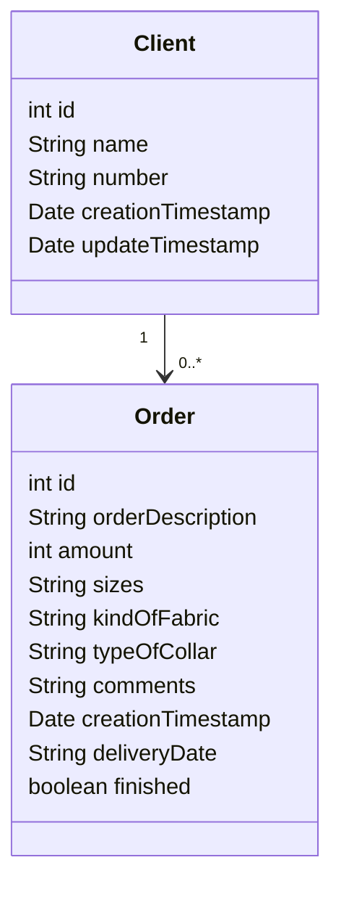

# SISTEMA DE PEDIDOS PARA EMPRESA KELPRINT

`http://localhost:8080/swagger-ui.html`

## Diagrama de Classes:

```mermaid
classDiagram
    class Client {
        int id
        String name
        String number
        Date creationTimestamp
        Date updateTimestamp
    }

    class Order {
        int id
        String orderDescription
        int amount
        String sizes
        String kindOfFabric
        String typeOfCollar
        String comments
        Date creationTimestamp
        String deliveryDate
        boolean finished
    }

    Client "1" --> "0..*" Order
```
